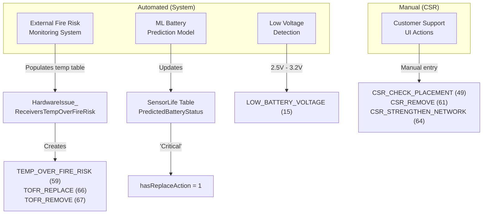
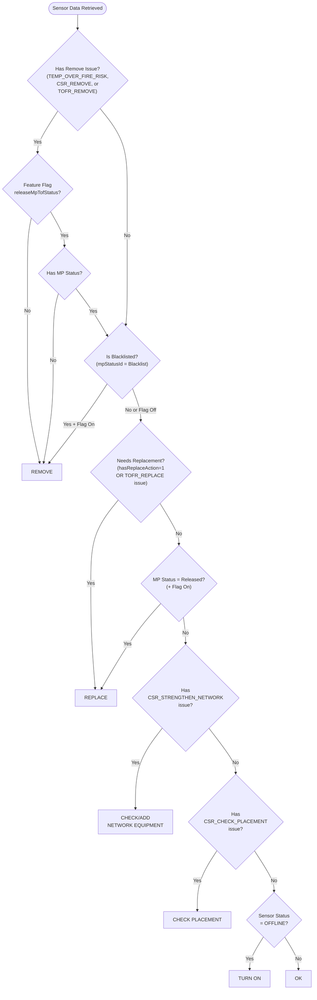

# Sensor Action Column Logic - Flowcharts

**Source**: CustomerDetail > Sensors page
**Last Updated**: 2026-02-03

---

## Diagram 1: Hardware Issue Origins (Automated vs Manual)

Shows which issues are created by the system vs manually by CSRs.

---

## Diagram 2: What Triggers "hasReplaceAction"?

The database calculates this flag based on battery status OR hardware issues.

---

## Diagram 3: Main Decision Flowchart

Shows the priority-based rule evaluation. First matching rule wins.

---

---

## Diagram 4: CSR-Friendly Decision Flowchart

**For Customer Support Representatives** - Uses terminology visible in the UI.

**Legend:**
- **🔥 TOFR Workflow**: Special safety workflow for high-temperature monitoring points
  - **Blacklist**: Confirmed safety risk - sensor must be removed
  - **Released**: Risk resolved - sensor should be replaced
  - **Pending Review**: Under evaluation (continues to standard checks)
- **Hardware Events**: Visible in the "Hardware Events" column
- **Battery Status**: From ML predictions (not directly visible, but shows in Action)
- **Sensor Status: Offline**: Sensor hasn't sent readings in 24+ hours

---

## Priority Summary

### For Engineers

| Priority | Action | Trigger |
|:--------:|--------|---------|
| 1 | **Remove** | Fire risk, CSR removal, Blacklisted MP |
| 2 | **Replace** | Critical battery, ActionID=1 issue, Released MP |
| 3 | **Check/Add Network** | CSR_STRENGTHEN_NETWORK |
| 4 | **Check Placement** | CSR_CHECK_PLACEMENT |
| 5 | **Turn On** | Sensor OFFLINE |
| 6 | **Ok** | Default (no issues) |

### For CSRs

| Priority | Action | When You See... |
|:--------:|--------|-----------------|
| 1 | **Remove** | Hardware Event: "Temp Over Fire Risk", "CSR - Remove", or "TOFR - Remove" OR Monitoring Point Status: "Blacklist" |
| 2 | **Replace** | Battery Status: Critical (predicted) OR Hardware Event: "TOFR - Replace" OR Monitoring Point Status: "Released" |
| 3 | **Check/Add Network Equipment** | Hardware Event: "CSR - Strengthen Network" |
| 4 | **Check Placement** | Hardware Event: "CSR - Check Placement" |
| 5 | **Turn On** | Sensor Status: "Offline" |
| 6 | **Ok** | No issues detected |
