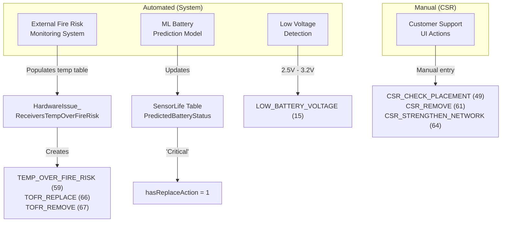
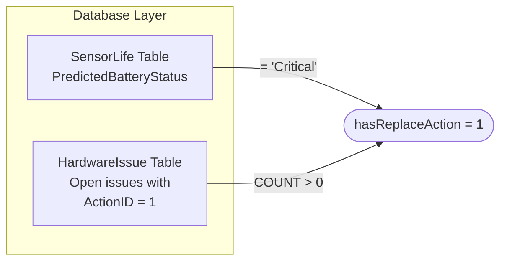

# Sensor Action Column Logic - Flowcharts

**Source**: CustomerDetail > Sensors page
**Last Updated**: 2026-02-03

---

## Diagram 1: Hardware Issue Origins (Automated vs Manual)

Shows which issues are created by the system vs manually by CSRs.

---

## Diagram 2: What Triggers "hasReplaceAction"?

The database calculates this flag based on battery status OR hardware issues.

---

## Diagram 3: Main Decision Flowchart

Shows the priority-based rule evaluation. First matching rule wins.

---

## Priority Summary

| Priority | Action | Trigger |
|:--------:|--------|---------|
| 1 | **Remove** | Fire risk, CSR removal, Blacklisted MP |
| 2 | **Replace** | Critical battery, ActionID=1 issue, Released MP |
| 3 | **Check/Add Network** | CSR_STRENGTHEN_NETWORK |
| 4 | **Check Placement** | CSR_CHECK_PLACEMENT |
| 5 | **Turn On** | Sensor OFFLINE |
| 6 | **Ok** | Default (no issues) |
