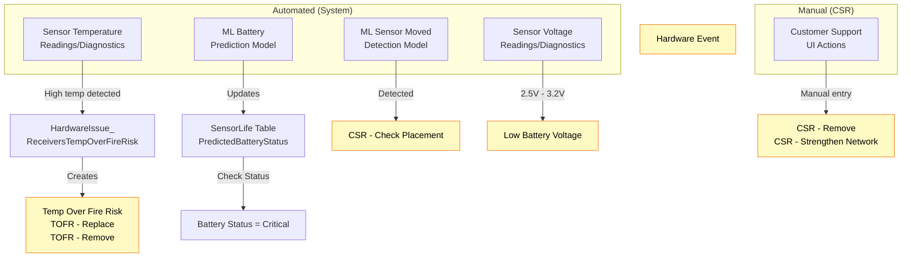
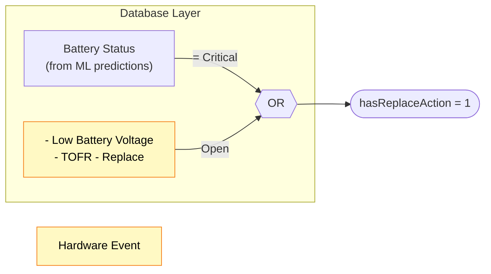
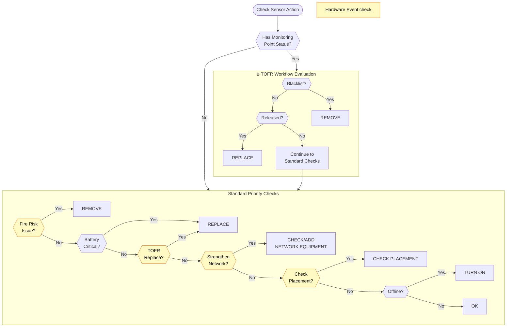
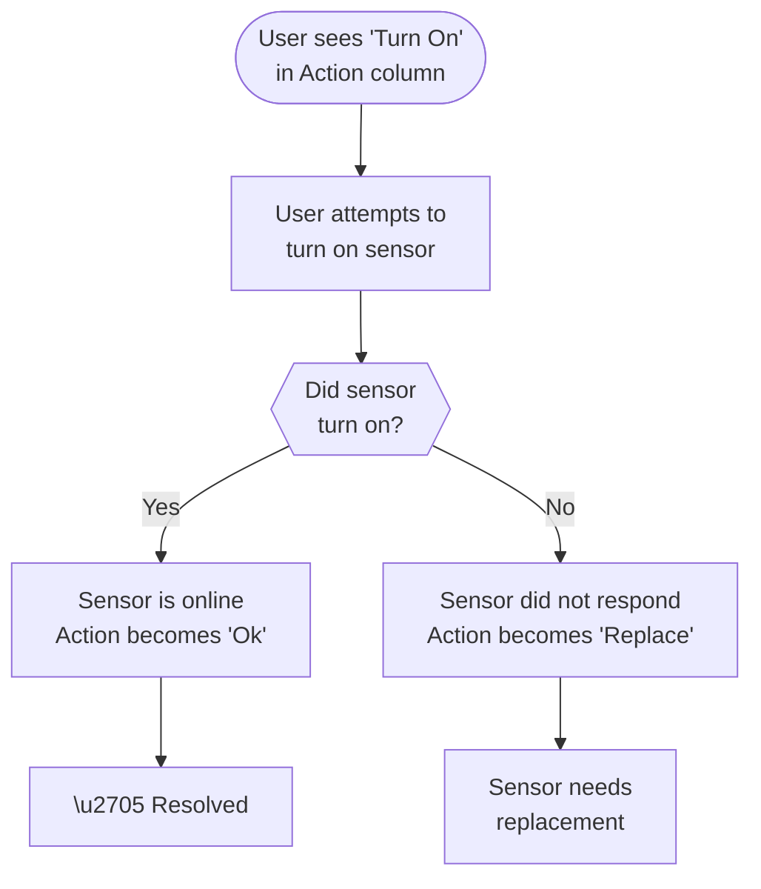

# Sensor Action Column Logic - Flowcharts

**Source**: CustomerDetail > Sensors page
**Last Updated**: 2026-02-03

---

## Legend

- **Yellow boxes** = Hardware Events or checks for Hardware Events
  - Hardware Events are visible in the "Hardware Events" column in the UI
  - Created automatically by system monitoring OR manually by CSR
  - Examples: "Temp Over Fire Risk", "CSR - Remove", "Low Battery Voltage", "TOFR Replace"
- **White boxes** = Status checks (NOT hardware events)
  - "Battery Critical" = ML prediction status
  - "Offline" = Sensor communication status
- **🔥 TOFR Workflow**: Special safety workflow for high-temperature monitoring points
  - **Blacklist**: Confirmed safety risk - sensor must be removed
  - **Released**: Risk resolved - sensor should be replaced
  - **Pending Review**: Under evaluation (continues to standard checks)

---

## Diagram 1: Hardware Issue Origins (Automated vs Manual)

Shows which issues are created by the system vs manually by CSRs.

---

## Diagram 2: What Triggers "Replace" Action?

The database determines if a sensor needs replacement based on battery status OR hardware events.

---

## Diagram 3: Decision Flowchart

Shows how the Action column value is determined, using terminology visible in the UI.

---

## Diagram 4: "Turn On" Troubleshooting Workflow

Shows what happens when a user sees "Turn On" in the Action column and attempts to resolve it.

**Note**: This diagram shows the user troubleshooting process that occurs AFTER the system has already determined the Action column should display "Turn On" (from Diagram 3).

---

## Priority Summary

| Priority | Action | Trigger Type | When You See... |
|:--------:|--------|:------------:|-----------------|
| 1 | **Remove** | 🟡 HWE or MP Status | **HWE**: "Temp Over Fire Risk", "CSR - Remove", "TOFR - Remove" **MP Status**: "Blacklist" |
| 2a | **Replace** | Battery Status | **Battery**: Critical (from ML prediction) |
| 2b | **Replace** | 🟡 HWE or MP Status | **HWE**: "TOFR - Replace", "Low Battery Voltage" **MP Status**: "Released" |
| 3 | **Check/Add Network** | 🟡 HWE | **HWE**: "CSR - Strengthen Network" |
| 4 | **Check Placement** | 🟡 HWE | **HWE**: "CSR - Check Placement" (auto-created by ML) |
| 5 | **Turn On** | Sensor Status | **Sensor Status**: "Offline" |
| 6 | **Ok** | None | No issues detected |
