# Research: Action Column Logic on CustomerDetail > Sensors

**Date**: 2026-02-03T17:21:11-0500
**Researcher**: aw-jwalker
**Git Commit**: 3c5ebe7271027f0eb17f206e0233c574c76c91ee
**Branch**: dev
**Repository**: fullstack.assetwatch

## Research Question

What determines the value displayed in the "Action" column on CustomerDetail > Sensors? What are all the possible values, and what triggers each one?

## Summary

The Action column displays one of **6 possible values** based on a priority-based rule system. The logic involves multiple layers:

1. **Database Layer**: Stored procedures aggregate hardware issues and calculate `hasReplaceAction`
2. **Frontend Layer**: The `getSensorAction()` function evaluates conditions in priority order

The possible actions (in priority order) are:
1. **Remove** - Sensor poses safety risk or is blacklisted
2. **Replace** - Battery is critical or has replacement-requiring hardware issue
3. **Check/Add Network Equipment** - Network connectivity issues
4. **Check Placement** - Sensor positioning issues
5. **Turn On** - Sensor is offline
6. **Ok** - No issues detected

## Detailed Findings

### Frontend Action Determination Logic

**File**: `apps/frontend/src/components/CustomerDetailPage/Sensors/ColumnDefs.tsx:80-128`

The `getSensorAction()` function uses a priority-based rule system. Rules are evaluated in order - **first matching rule wins**.

```typescript
type SensorAction =
  | "Remove"
  | "Replace"
  | "Check/Add Network Equipment"
  | "Check Placement"
  | "Turn On"
  | "Ok";
```

#### Priority 1: "Remove"

Displayed when the sensor poses a safety risk or should be taken out of service:

| Condition | Feature Flag Required |
|-----------|----------------------|
| Sensor has `TEMP_OVER_FIRE_RISK` (59) hardware issue | No |
| Sensor has `CSR_REMOVE` (61) hardware issue | No |
| Sensor has `TOFR_REMOVE` (67) hardware issue | No |
| Monitoring Point status is "Blacklist" | Yes (`releaseMpTofStatus`) |
| No MP status AND has a remove issue | Yes (`releaseMpTofStatus`) |

#### Priority 2: "Replace"

Displayed when the sensor needs to be swapped out:

| Condition | Feature Flag Required |
|-----------|----------------------|
| `hasReplaceAction` is truthy (1) | No |
| Sensor has `TOFR_REPLACE` (66) hardware issue | No |
| Monitoring Point status is "Released" | Yes (`releaseMpTofStatus`) |

**`hasReplaceAction` is calculated in the database as TRUE when:**
- Battery `PredictedBatteryStatus` = "Critical" (from `SensorLife` table), OR
- Sensor has ANY open hardware issue where `HardwareIssueTypeActionID = 1`

#### Priority 3: "Check/Add Network Equipment"

Displayed when there are network connectivity issues:

| Condition | Feature Flag Required |
|-----------|----------------------|
| Sensor has `CSR_STRENGTHEN_NETWORK` (64) hardware issue | No |

#### Priority 4: "Check Placement"

Displayed when the sensor may be incorrectly positioned:

| Condition | Feature Flag Required |
|-----------|----------------------|
| Sensor has `CSR_CHECK_PLACEMENT` (49) hardware issue | No |

#### Priority 5: "Turn On"

Displayed when the sensor is not communicating:

| Condition | Feature Flag Required |
|-----------|----------------------|
| Sensor status (`rstid`) is `OFFLINE` (4) | No |

#### Priority 6: "Ok" (Default)

Displayed when no other conditions match.

### Hardware Issue Types That Affect Action Column

**File**: `apps/frontend/src/shared/enums/HardwareIssueType.ts`

| ID | Enum Name | Display Name | Triggers Action |
|----|-----------|--------------|-----------------|
| 49 | `CSR_CHECK_PLACEMENT` | CSR - Check Placement | Check Placement |
| 59 | `TEMP_OVER_FIRE_RISK` | Temp Over Fire Risk | Remove |
| 61 | `CSR_REMOVE` | CSR - Remove | Remove |
| 64 | `CSR_STRENGTHEN_NETWORK` | CSR - Strengthen Network | Check/Add Network Equipment |
| 66 | `TOFR_REPLACE` | TOFR - Replace | Replace |
| 67 | `TOFR_REMOVE` | TOFR - Remove | Remove |

**Note on CSR Issues**: Hardware events prefixed with "CSR" (Customer Support Rep) are typically added manually by Customer Support Representatives, with possible exceptions like "Check Sensor Position" which may be automated.

### Database Layer: How Data is Retrieved

**File**: `mysql/db/procs/R__PROC_Receiver_GetReceiverList.sql`

This stored procedure is the main data source for CustomerDetail > Sensors. It returns:

1. **`hardwareIssueIDs`** (line 75-79): Comma-separated list of open hardware issue type IDs
2. **`hardwareIssueNames`** (line 70-74): Comma-separated list of open hardware issue names
3. **`hasReplaceAction`** (line 105-110): Boolean calculated as:

```sql
SELECT sl.PredictedBatteryStatus = "Critical" OR (
  SELECT COUNT(hi.HardwareIssueID) > 0 FROM HardwareIssue hi
    INNER JOIN HardwareIssueStatus hs ON hs.HardwareIssueStatusID = hi.HardwareIssueStatusID
    INNER JOIN HardwareIssueType hit ON hit.HardwareIssueTypeID = hi.HardwareIssueTypeID
  WHERE hit.HardwareIssueTypeActionID = 1 AND hi.ReceiverID = r.ReceiverID
    AND hs.HardwareIssueStatusOpen = 1
) AS hasReplaceAction
```

4. **`mpStatusId`** (line 40): Monitoring Point status ID (for Released/Blacklist checks)
5. **`rstid`** (line 56): Receiver status ID (for OFFLINE check)

### How Hardware Issues Get Created

#### Manual Creation (CSR Issues)

CSR-prefixed hardware issues are typically created manually by Customer Support Representatives through the UI, calling stored procedures like:

- `HardwareIssue_AddHardwareIssue` - Single issue creation
- `HardwareIssue_BulkAddHardwareIssues` - Bulk creation from serial numbers
- `HardwareIssue_BulkAddReceiverIssues` - Bulk creation from receiver IDs

#### Automated Creation (System Issues)

**TEMP_OVER_FIRE_RISK (59)**:

**File**: `mysql/db/procs/R__PROC_HardwareIssue_ReceiversTempOverFireRisk.sql`

This stored procedure runs as a periodic job:
1. Reads from `Temp_ReceiverOverFireRisk` temporary table (populated by external monitoring system)
2. Matches sensor serial numbers to receivers
3. Creates hardware issue type 59 if not already open
4. Also flags the Monitoring Point with `RemoveFlag=1` and sets status to "Pending Review"

**Battery Critical (triggers hasReplaceAction)**:

The `SensorLife` table contains battery predictions from a machine learning model. When `PredictedBatteryStatus = "Critical"`, the sensor shows "Replace" action.

**LOW_BATTERY_VOLTAGE (15)**:

**File**: `mysql/db/procs/R__PROC_HardwareIssue_ReceiversLowVolatage.sql`

Automatically creates issues when receiver voltage is between 2.5V - 3.2V.

### HardwareIssueTypeActionID Mapping

Hardware issue types have an `HardwareIssueTypeActionID` that categorizes the recommended action:

| ActionID | Action Name | Effect |
|----------|-------------|--------|
| 1 | Replace | Sets `hasReplaceAction = 1` |
| 2 | Move | - |
| 3 | No Action Needed | - |
| 4 | Remove | - |
| 5 | Check/Add Network Equipment | - |

When a hardware issue has `HardwareIssueTypeActionID = 1`, it contributes to the `hasReplaceAction` flag being true.

### Visual Styling

**File**: `apps/frontend/src/components/CustomerDetailPage/Sensors/ColumnDefs.tsx:159-162`

Actions other than "Ok" are styled with the CSS class `grid-cell-temp-critical`, which applies a red/critical visual highlight to draw attention.

### Column Visibility

The Action column is hidden from customer users unless they are:
- Team members
- Partners
- Have `isCustomerHardwareStatusAdvanced` role

## Code References

- `apps/frontend/src/components/CustomerDetailPage/Sensors/ColumnDefs.tsx:80-128` - `getSensorAction()` function
- `apps/frontend/src/components/CustomerDetailPage/Sensors/ColumnDefs.tsx:147-163` - Action column definition
- `apps/frontend/src/components/CustomerDetailPage/Sensors/ColumnDefs.tsx:40-46` - `hasHardwareIssue()` helper
- `apps/frontend/src/shared/enums/HardwareIssueType.ts` - All hardware issue type IDs
- `apps/frontend/src/shared/enums/SensorStatus.ts` - Sensor status enum (OFFLINE = 4)
- `mysql/db/procs/R__PROC_Receiver_GetReceiverList.sql:105-110` - `hasReplaceAction` calculation
- `mysql/db/procs/R__PROC_Receiver_GetReceiverList.sql:70-79` - Hardware issue aggregation
- `mysql/db/procs/R__PROC_HardwareIssue_ReceiversTempOverFireRisk.sql` - Automated fire risk detection

## Architecture Documentation

### Data Flow

```
┌─────────────────────────────────────────────────────────────────────────────┐
│                           UPSTREAM TRIGGERS                                  │
├─────────────────────────────────────────────────────────────────────────────┤
│                                                                             │
│  ┌──────────────────┐    ┌──────────────────┐    ┌──────────────────────┐  │
│  │ External Monitor │    │   ML Battery     │    │   CSR Manual Entry   │  │
│  │ (Fire Risk)      │    │   Predictions    │    │   (UI Actions)       │  │
│  └────────┬─────────┘    └────────┬─────────┘    └──────────┬───────────┘  │
│           │                       │                          │              │
│           ▼                       ▼                          ▼              │
│  ┌──────────────────┐    ┌──────────────────┐    ┌──────────────────────┐  │
│  │ Temp_Receiver    │    │   SensorLife     │    │ HardwareIssue_Add    │  │
│  │ OverFireRisk     │    │   Table          │    │ HardwareIssue proc   │  │
│  └────────┬─────────┘    └────────┬─────────┘    └──────────┬───────────┘  │
│           │                       │                          │              │
└───────────┼───────────────────────┼──────────────────────────┼──────────────┘
            │                       │                          │
            ▼                       ▼                          ▼
┌─────────────────────────────────────────────────────────────────────────────┐
│                           DATABASE LAYER                                     │
├─────────────────────────────────────────────────────────────────────────────┤
│                                                                             │
│  ┌────────────────────────────────────────────────────────────────────┐    │
│  │                      HardwareIssue Table                           │    │
│  │  - ReceiverID                                                      │    │
│  │  - HardwareIssueTypeID (links to HardwareIssueType)               │    │
│  │  - HardwareIssueStatusID (1=Open, 2=Resolved)                     │    │
│  └────────────────────────────────────────────────────────────────────┘    │
│                                    │                                        │
│                                    ▼                                        │
│  ┌────────────────────────────────────────────────────────────────────┐    │
│  │              Receiver_GetReceiverList Procedure                    │    │
│  │                                                                    │    │
│  │  Returns per sensor:                                              │    │
│  │  • hardwareIssueIDs (CSV of type IDs)                            │    │
│  │  • hasReplaceAction (battery critical OR ActionID=1 issue)       │    │
│  │  • mpStatusId (Released/Blacklist status)                        │    │
│  │  • rstid (sensor status - OK/OFFLINE/etc)                        │    │
│  └────────────────────────────────────────────────────────────────────┘    │
│                                                                             │
└─────────────────────────────────────────────────────────────────────────────┘
                                     │
                                     ▼
┌─────────────────────────────────────────────────────────────────────────────┐
│                           FRONTEND LAYER                                     │
├─────────────────────────────────────────────────────────────────────────────┤
│                                                                             │
│  ┌────────────────────────────────────────────────────────────────────┐    │
│  │                    getSensorAction() Function                      │    │
│  │                                                                    │    │
│  │  Priority-based rule evaluation:                                  │    │
│  │                                                                    │    │
│  │  1. "Remove"                                                       │    │
│  │     └─ TEMP_OVER_FIRE_RISK OR CSR_REMOVE OR TOFR_REMOVE          │    │
│  │     └─ OR Blacklisted (with feature flag)                        │    │
│  │                                                                    │    │
│  │  2. "Replace"                                                      │    │
│  │     └─ hasReplaceAction=1 OR TOFR_REPLACE                        │    │
│  │     └─ OR Released status (with feature flag)                    │    │
│  │                                                                    │    │
│  │  3. "Check/Add Network Equipment"                                  │    │
│  │     └─ CSR_STRENGTHEN_NETWORK                                     │    │
│  │                                                                    │    │
│  │  4. "Check Placement"                                              │    │
│  │     └─ CSR_CHECK_PLACEMENT                                        │    │
│  │                                                                    │    │
│  │  5. "Turn On"                                                      │    │
│  │     └─ Sensor status = OFFLINE                                    │    │
│  │                                                                    │    │
│  │  6. "Ok" (default)                                                 │    │
│  │     └─ No conditions matched                                      │    │
│  └────────────────────────────────────────────────────────────────────┘    │
│                                    │                                        │
│                                    ▼                                        │
│  ┌────────────────────────────────────────────────────────────────────┐    │
│  │                    Action Column Display                           │    │
│  │                                                                    │    │
│  │  • "Ok" - Normal styling                                          │    │
│  │  • All others - Red/critical highlight (grid-cell-temp-critical)  │    │
│  └────────────────────────────────────────────────────────────────────┘    │
│                                                                             │
└─────────────────────────────────────────────────────────────────────────────┘
```

## Quick Reference: When Each Action Appears

| Action | When It Appears |
|--------|-----------------|
| **Remove** | Fire risk detected, CSR flagged for removal, blacklisted MP |
| **Replace** | Battery predicted critical, hardware issue requires replacement, MP released |
| **Check/Add Network Equipment** | CSR flagged network issues |
| **Check Placement** | CSR flagged positioning issues |
| **Turn On** | Sensor status is OFFLINE |
| **Ok** | Everything is normal |

## Mermaid Diagrams

### Decision Flowchart

```mermaid
flowchart TD
    START(["Sensor Data Retrieved"])

    START --> CHECK_REMOVE{"Has Remove Issue?<br/>(TEMP_OVER_FIRE_RISK,<br/>CSR_REMOVE, or<br/>TOFR_REMOVE)"}

    CHECK_REMOVE -->|Yes| CHECK_FLAG1{"Feature Flag<br/>releaseMpTofStatus?"}
    CHECK_FLAG1 -->|No| REMOVE["🔴 REMOVE"]
    CHECK_FLAG1 -->|Yes| CHECK_MPSTATUS{"Has MP Status?"}
    CHECK_MPSTATUS -->|No| REMOVE
    CHECK_MPSTATUS -->|Yes| CHECK_BLACKLIST

    CHECK_REMOVE -->|No| CHECK_BLACKLIST{"Is Blacklisted?<br/>(mpStatusId = Blacklist)"}
    CHECK_BLACKLIST -->|Yes + Flag On| REMOVE
    CHECK_BLACKLIST -->|No or Flag Off| CHECK_REPLACE

    CHECK_REPLACE{"Needs Replacement?<br/>(hasReplaceAction=1<br/>OR TOFR_REPLACE issue)"}
    CHECK_REPLACE -->|Yes| REPLACE["🟠 REPLACE"]

    CHECK_REPLACE -->|No| CHECK_RELEASED{"MP Status = Released?<br/>(+ Flag On)"}
    CHECK_RELEASED -->|Yes| REPLACE

    CHECK_RELEASED -->|No| CHECK_NETWORK{"Has<br/>CSR_STRENGTHEN_NETWORK<br/>issue?"}
    CHECK_NETWORK -->|Yes| NETWORK["🟡 CHECK/ADD<br/>NETWORK EQUIPMENT"]

    CHECK_NETWORK -->|No| CHECK_PLACEMENT{"Has<br/>CSR_CHECK_PLACEMENT<br/>issue?"}
    CHECK_PLACEMENT -->|Yes| PLACEMENT["🟡 CHECK PLACEMENT"]

    CHECK_PLACEMENT -->|No| CHECK_OFFLINE{"Sensor Status<br/>= OFFLINE?"}
    CHECK_OFFLINE -->|Yes| TURNON["🟡 TURN ON"]

    CHECK_OFFLINE -->|No| OK["🟢 OK"]

    style REMOVE fill:#ff6b6b,color:#fff
    style REPLACE fill:#ffa94d,color:#fff
    style NETWORK fill:#ffd43b,color:#000
    style PLACEMENT fill:#ffd43b,color:#000
    style TURNON fill:#ffd43b,color:#000
    style OK fill:#51cf66,color:#fff
```



### What Triggers "hasReplaceAction"?


### Hardware Issue Origins (Automated vs Manual)


## Related Resources

- **Notion Page**: [Sensor Action Column Logic - Flowchart](https://www.notion.so/2fc7eb69ae9d815d957ffe15fd4eddd5)

## Open Questions

1. What external system populates the `Temp_ReceiverOverFireRisk` table, and at what temperature threshold?
2. How is the `SensorLife.PredictedBatteryStatus` calculated (ML model details)?
3. Are there any other automated processes that create hardware issues affecting the Action column?
