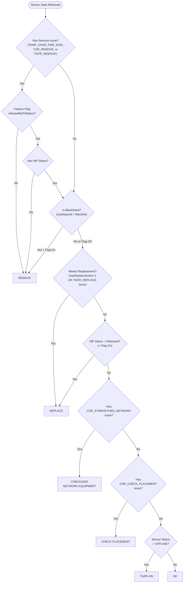

# Action Column Logic - Technical Implementation

**Audience**: Engineers and Developers
**Parent**: Action Column Flowcharts (CSR Version)
**Date**: 2026-02-03

---

## Technical Decision Flowchart

This flowchart shows the actual implementation logic with technical variable names, feature flags, and code-level details.



---

## Code Implementation

**File**: `apps/frontend/src/components/CustomerDetailPage/Sensors/ColumnDefs.tsx:80-128`

### Function Signature

```typescript
export const getSensorAction = (
  data: Sensor,
  mpStatuses: MP_STATUS,
  releaseMpTofStatus: boolean,
): SensorAction
```

### Priority Rules (Evaluated in Order)

```typescript
const actionRules: ActionRule[] = [
  {
    action: "Remove",
    condition: () =>
      (releaseMpTofStatus && hasBeenBlacklisted) ||
      (releaseMpTofStatus && !data.mpStatusId && hasRemoveIssue) ||
      (!releaseMpTofStatus && hasRemoveIssue),
  },
  {
    action: "Replace",
    condition: () =>
      Boolean(data.hasReplaceAction) ||
      hasHardwareIssue(ids, HardwareIssueType.TOFR_REPLACE) ||
      (releaseMpTofStatus && hasBeenReleased),
  },
  {
    action: "Check/Add Network Equipment",
    condition: () =>
      hasHardwareIssue(ids, HardwareIssueType.CSR_STRENGTHEN_NETWORK),
  },
  {
    action: "Check Placement",
    condition: () =>
      hasHardwareIssue(ids, HardwareIssueType.CSR_CHECK_PLACEMENT),
  },
  {
    action: "Turn On",
    condition: () => data.rstid === SensorStatus.OFFLINE,
  },
];

return actionRules.find((rule) => rule.condition())?.action ?? "Ok";
```

---

## Technical Variables

### From Sensor Data Object

| Variable | Type | Source | Meaning |
|----------|------|--------|---------|
| `data.hardwareIssueIDs` | string | CSV of IDs | Comma-separated hardware issue type IDs |
| `data.hasReplaceAction` | number | Calculated | 0 or 1, from database query |
| `data.mpStatusId` | number | MonitoringPointStatusID | 1-5 or NULL |
| `data.rstid` | number | ReceiverStatusID | 1-7 |

### Hardware Issue Type Enum Values

```typescript
enum HardwareIssueType {
  CSR_CHECK_PLACEMENT = 49,
  TEMP_OVER_FIRE_RISK = 59,
  CSR_REMOVE = 61,
  CSR_STRENGTHEN_NETWORK = 64,
  TOFR_REPLACE = 66,
  TOFR_REMOVE = 67,
}
```

### Status ID Mappings

```typescript
// MonitoringPointStatus
mpStatuses.Released = 2
mpStatuses.Blacklist = 5

// ReceiverStatus
SensorStatus.OFFLINE = 4
SensorStatus.OK = 5
```

---

## Database Query

**Stored Procedure**: `R__PROC_Receiver_GetReceiverList.sql:105-110`

### hasReplaceAction Calculation

```sql
SELECT sl.PredictedBatteryStatus = "Critical" OR (
  SELECT COUNT(hi.HardwareIssueID) > 0 FROM HardwareIssue hi
    INNER JOIN HardwareIssueStatus hs ON hs.HardwareIssueStatusID = hi.HardwareIssueStatusID
    INNER JOIN HardwareIssueType hit ON hit.HardwareIssueTypeID = hi.HardwareIssueTypeID
  WHERE hit.HardwareIssueTypeActionID = 1
    AND hi.ReceiverID = r.ReceiverID
    AND hs.HardwareIssueStatusOpen = 1
) AS hasReplaceAction
```

**Returns TRUE when**:
- `SensorLife.PredictedBatteryStatus = "Critical"`, OR
- Sensor has any open issue with `HardwareIssueTypeActionID = 1`
  - Low Battery Voltage (15)
  - TOFR - Replace (66)

---

## Feature Flag: releaseMpTofStatus

**Purpose**: Controls whether monitoring point statuses (Released/Blacklist) affect the Action column

**When Enabled**:
- Blacklisted monitoring points → "Remove" action
- Released monitoring points → "Replace" action
- Removes sensors without MP status → "Remove" action (if they have fire risk issue)

**When Disabled**:
- Only hardware issues determine actions
- MP status ignored

---

## Helper Function

```typescript
export const hasHardwareIssue = (
  hardwareIssueIDs: string | undefined,
  ...issueTypes: HardwareIssueType[]
): boolean =>
  issueTypes.some(
    (type) => hardwareIssueIDs?.split(",").includes(type.toString()) ?? false,
  );
```

**Usage**: Check if sensor has specific hardware issue type(s)

---

## Related Files

- `apps/frontend/src/components/CustomerDetailPage/Sensors/ColumnDefs.tsx:80-128` - Main logic
- `apps/frontend/src/shared/enums/HardwareIssueType.ts` - Issue type enum
- `apps/frontend/src/shared/enums/SensorStatus.ts` - Sensor status enum
- `apps/frontend/src/shared/types/sensors/Sensor.ts` - Sensor type definition
- `mysql/db/procs/R__PROC_Receiver_GetReceiverList.sql` - Data source query

---

## Testing

**Test File**: `apps/frontend/src/components/CustomerDetailPage/Sensors/tests/ColumnDefs.test.ts`

Comprehensive test coverage including:
- Each action condition
- Priority order verification
- Feature flag behavior
- Edge cases (null, empty, multiple issues)

Run tests:
```bash
pnpm --filter frontend test ColumnDefs.test.ts
```
